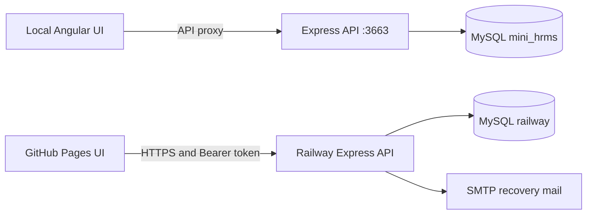

# Architecture

Snapshot: 21 September 2026. `backend/` below means the separate sibling miniHrmsServer repository.

## Runtime boundaries

The browser is untrusted. Route guards and hidden buttons aid UX; Express verifies tokens, database sessions, active users/roles and permissions. Pages serves static assets only and cannot run the backend or the local proxy.

## Source map

| Area | Source | Responsibility |
| --- | --- | --- |
| Routes | src/app/app-routing.module.ts; admin/admin-routing.module.ts | Public home/auth and guarded workspace |
| API | src/app/api-services/portal.service.ts | /api/portal, envelopes, failures and mutation events |
| Shared UI | src/app/ui | Shell, auth layout, select, tooltip, feedback, avatar, field presentation |
| Workspace | src/app/admin/pages/workspace | Resource and account views |
| Styling | src/styles.css | Tokens, components and responsive overrides |
| Local startup | scripts/start-local.js; proxy.conf.js | Backend startup/readiness and API forwarding |
| Pages | scripts/build-pages.js; pages-config.js; pages-fallback.js | Config, build, runtime asset and 404 fallback |
| Backend | backend/source/server.js; source/portal/router.js | Middleware, health, authentication and HR workflows |
| Database | backend/knexfile.js; db_migrations; database/schema | Connection and incremental schema management |

Declared stack: Angular 10.1, TypeScript 3.9, RxJS 6, CDK 10; Express 4, Knex 0.21, mysql/mysql2, bcrypt 5, jsonwebtoken 8 and multer 1.4.3 in backend package.json. These are declarations, not an advisory audit. CI uses Node 24 to install dependencies and Node 12.22.12 for the legacy Angular build. Backend deployment uses Node 24.

## Portal contracts

Base is environment.apiUrl + /portal. Success envelope: `{success:true,data,message}`. PortalService unwraps data; safe error messages are handled centrally. Bearer tokens are sent to the application's API.

| Methods and paths | Responsibility |
| --- | --- |
| POST /auth/login, /auth/signup, /auth/forgot, /auth/reset | Validated/throttled public authentication |
| POST /auth/logout | Session revocation and audit closure |
| GET /dashboard | Scoped aggregates/recent team records excluding self |
| GET /resources/:kind | Pagination/search/status/sort; page size 1–100; allowlisted sort |
| POST /resources/:kind; PUT /resources/:kind/:id | Resource-specific permission and field allowlists |
| PUT /requests/:id/review | Transactional review with no self-review |
| GET /notifications/unread; POST /notifications/read | Visible count and monotonic per-user watermark |
| GET /me; PUT /me | Current account and permitted personal updates |
| POST /me/avatar; POST /me/avatar/remove | Multipart avatar; PNG/JPEG up to 5 MB; JSON data URL |
| POST /me/password | Session-authenticated change; revoke other sessions |
| GET /employees/:empId | Own employment record or employee-read permission |
| GET /shortcuts | Catalog shortcuts excluding Learning routes |

This inventory is not a complete OpenAPI schema. Payloads vary by resource. No generic DELETE endpoint exists in this router. Legacy /api handlers remain behind administrator authorization and require separate review.

## Data and migration order

Employee identity links to credentials, personal/onboarding/bank records and login audit. Portal tables add sessions, recovery challenges, throttling, requests, notifications, catalogs and preferences.

Backend db_migrations contains:

1. 202609190001_reconcile_mini_hrms_tables.js: baseline reconciliation.
2. 202609190002_install_missing_mini_hrms_routines.js: missing routines; custom installed routines retained.
3. 202609190003_people_workspace.js: portal tables/catalogs, including historical Learning artifacts.
4. 202609210001_notification_read_state.js: per-user read watermark.
5. 202609210002_profile_username_cascade.js: credential username relationships.

Local database is mini_hrms; production is railway. source/configs/database-target.js validates the requested and actual connection target. Migrations need an existing database; they do not rename/copy it. Baseline SQL targets local mini_hrms. MySQL DDL can commit implicitly: use backups, isolated upgrade checks and forward repair. Do not rewrite applied history for Learning cleanup.

## Deployment

UI: .github/workflows/deploy-pages.yml. Backend: .github/workflows/backend-ci.yml, Dockerfile and railway.json. Railway runs deploy:prepare before startup and checks /api/health/ready. That check queries a portal table, not every workflow.

API_URL is public HTTPS ending in /api. PAGES_BASE_PATH is / or /repository/. Clean Pages deep links initially receive HTTP 404, then JavaScript restores the route; this is not a server rewrite. See [deployment guide](DEPLOYMENT.md).

Open concerns: broad legacy surface, monolithic router, avatar query cost, schema-dictionary coverage and repeatable integration tests. See [tasks](../TASKS.md).
